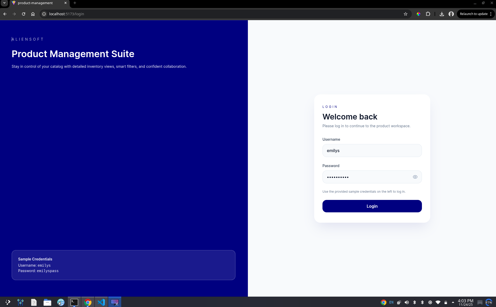
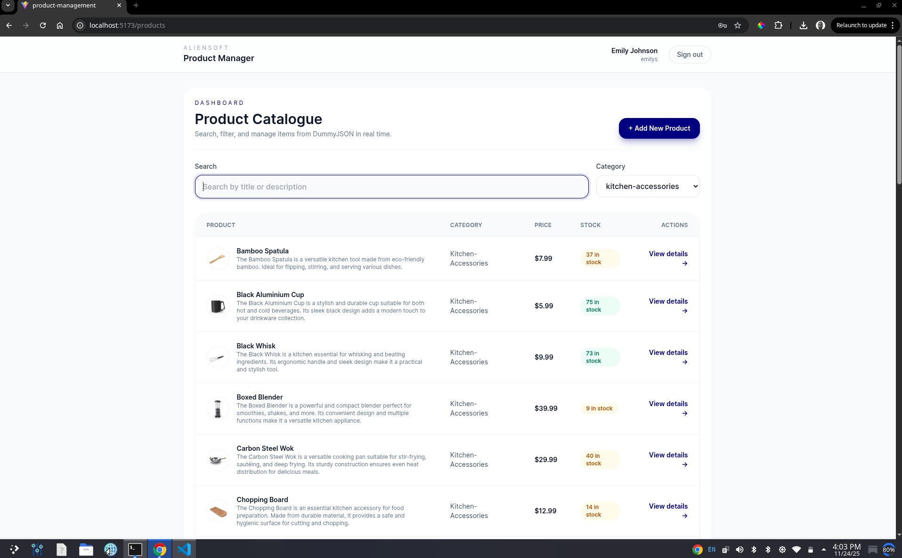
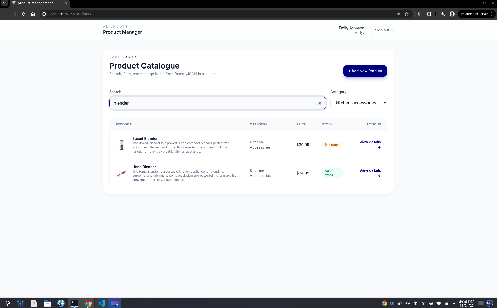
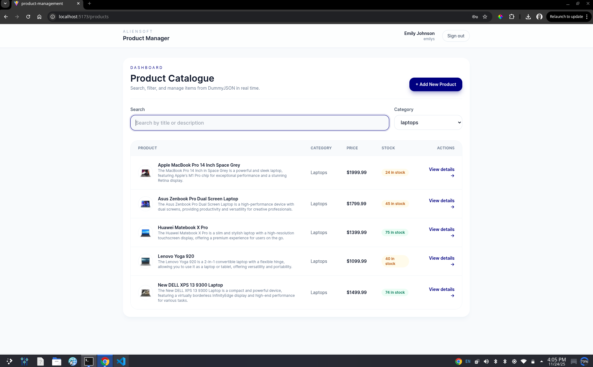
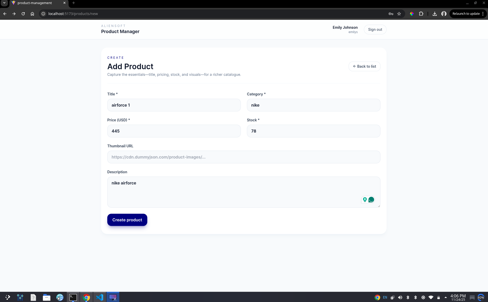
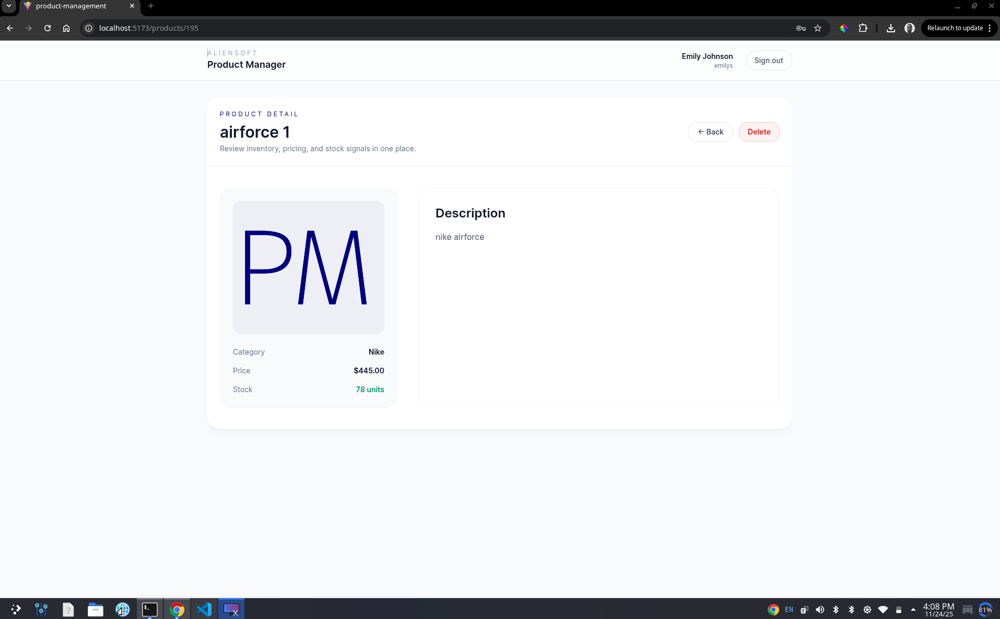
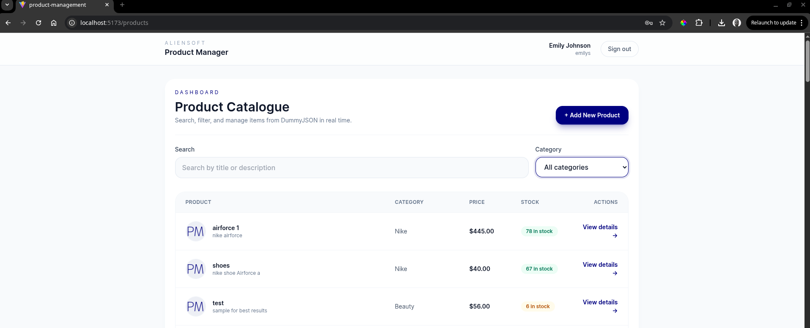

#  Product Management Suite by Sarota Raphael

## Hosted URL
The project is live at:
https://topher254.github.io/product-manager/

## GitHub Repository
Source code is available at:
https://github.com/Topher254/product-manager


A modern, responsive product management application built with Vue.js 3, featuring authentication, CRUD operations, and a beautiful user interface.


##  Application Screenshots

###  Authentication

*Secure login interface with password visibility toggle*

###  Product Dashboard

*Comprehensive product listing with search and filtering capabilities*

###  Smart Filtering

*Real-time search functionality across product catalog*


*Category-based filtering for quick product discovery*

###  Product Management

*Intuitive product creation form with validation*


*Success feedback when new products are created*


*Updated product list showing newly added items*

##  Features

###  Authentication & Security
- **JWT-based Authentication** with secure token storage
- **Route Protection** for authenticated pages only
- **Session Persistence** across browser refreshes
- **Password Visibility Toggle** for enhanced UX

###  Product Management
- **Complete CRUD Operations** (Create, Read, Update, Delete)
- **Real-time Search** across product titles and descriptions
- **Category Filtering** for organized product browsing
- **Responsive Product Cards** with rich product information
- **Image Thumbnails** with circular design

###  User Experience
- **Modern UI/UX** with Tailwind CSS styling
- **Primary Brand Color** (#000080) throughout
- **Loading States** with elegant spinners
- **Error Handling** with user-friendly messages
- **Responsive Design** for all device sizes

##  Tech Stack

### Frontend Framework
- **Vue.js 3** - Composition API
- **Vue Router** - Navigation and route protection
- **Pinia** - State management
- **Axios** - HTTP client for API calls

### Styling & UI
- **Tailwind CSS** - Utility-first CSS framework
- **Custom Components** - Reusable UI elements
- **Responsive Design** - Mobile-first approach

### API Integration
- **DummyJSON** - Mock backend API
- **RESTful endpoints** for products and authentication
- **Token-based authentication** for secure requests

##  Quick Start

### Prerequisites
- Node.js (v16 or higher)
- npm or yarn

### Installation

1. **Clone the repository**
```bash
git clone https://github.com/Topher254/product-manager.git
cd product-management
```

2. **Install dependencies**
```bash
npm install
```

3. **Start development server**
```bash
npm run dev
```

4. **Build for production**
```bash
npm run build
```

### Environment Setup
No environment variables required - uses public DummyJSON API.

##  Project Structure

```
product-management/
├── public/                 # Static assets
├── src/
│   ├── assets/            # Images and static files
│   ├── components/        # Reusable Vue components
│   │   ├── layout/        # Layout components
│   │   └── ui/            # UI components
│   ├── pages/             # Route components
│   │   ├── LoginView.vue
│   │   ├── ProductListView.vue
│   │   ├── ProductDetailView.vue
│   │   └── ProductCreateView.vue
│   ├── router/            # Vue Router configuration
│   ├── stores/            # Pinia state management
│   │   ├── auth.js        # Authentication store
│   │   └── products.js    # Products store
│   ├── services/          # API services
│   │   └── api.js         # Axios configuration
│   └── App.vue           # Root component
├── tailwind.config.js    # Tailwind CSS configuration
└── vite.config.js       # Vite build tool configuration
```

##  Authentication

### Demo Credentials
```
Username: emilys
Password: emilyspass
```

### Alternative Test Accounts
```
Username: kminchelle
Password: 0lelplR
```

##  Available Routes

- `/login` - Authentication page
- `/products` - Product listing with search/filter
- `/products/new` - Add new product form
- `/products/:id` - Product details view

##  Key Features Detail

### State Management
- **Auth Store**: Manages user authentication state and tokens
- **Products Store**: Handles product data, loading states, and errors
- **Persistent Sessions**: Automatic re-authentication on page refresh

### Product Operations
- **Fetch Products**: With search and category filters
- **View Product Details**: Full product information display
- **Add New Products**: Form with validation and error handling
- **Delete Products**: With confirmation dialog

### UI/UX Features
- **Responsive Grid Layouts** that adapt to screen size
- **Interactive Form Elements** with real-time validation
- **Loading Spinners** during API operations
- **Toast Notifications** for user actions
- **Hover Effects** and smooth transitions

